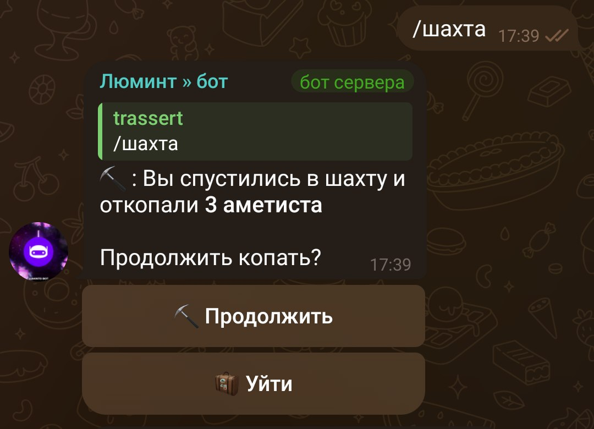
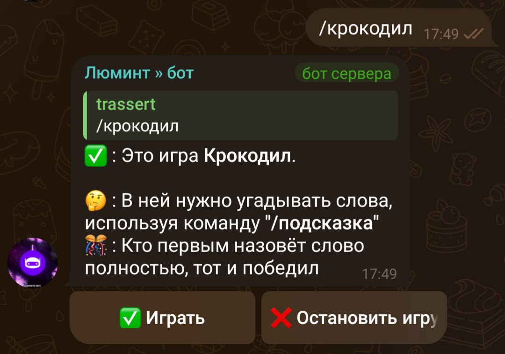
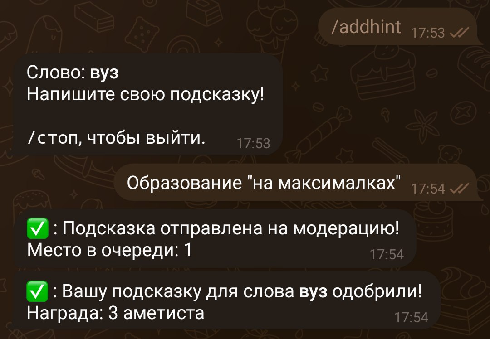
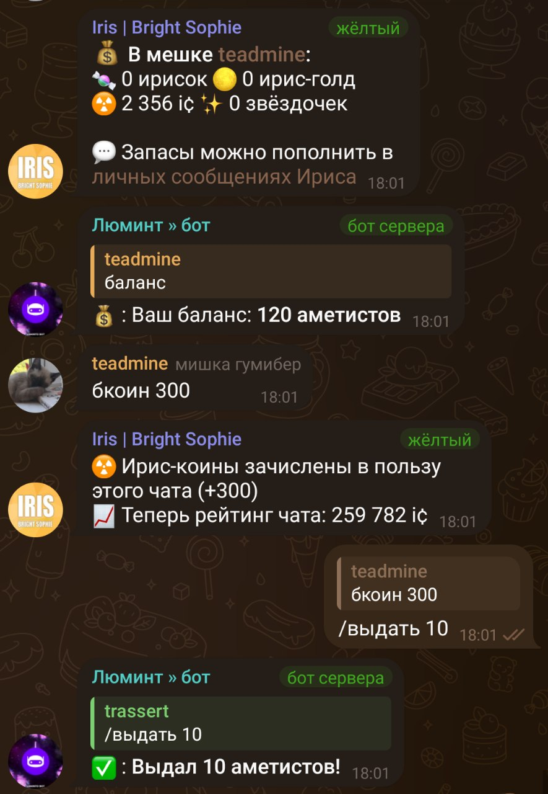
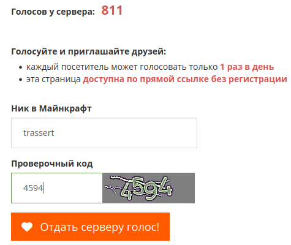

!!!
В этой статье будут описаны возможные варианты получения внутренней валюты сервера (аметисты)
!!!

### ⛏️ /шахта

Получить аметисты можно, используя команду `/шахта` в нашем [телеграм-чате](https://t.me/lumintomc), находясь в любом из государств (их список можно посмотреть командой `/госва`).

Продвигаясь глубже в шахте, вы получаете больше аметистов, но рискуете умереть и потерять всё!

### 🐊 Мини-игра "Крокодил"

В нашем чате вы можете играть в мини-игру "Крокодил". В ней нужно угадывать слово, имея подсказку.

Команды:
- `/ставка [Число]` для того чтобы поставить аметисты
- `/крокодил` для запуска игры

### 💁 Добавление подсказок

Вы можете помочь серверу, добавляя новые подсказки в пул мини игры "Крокодил". За каждую одобренную подсказку даётся +3 аметиста.
Критерии подсказок:
- Подходит к слову
- Правильно расставлены запятые, скобки и др. знаки препинания
- Не содержит матерных слов
- Не содержит самого слова ни в каком виде

Для создания: `/addhint` в [ЛС бота](https://t.me/luminto_chatbot)

### Обмен ☢️ ic на аметисты

Вы можете обменивать ирис-коины на аметисты, донатя в чат. Для этого вам нужно написать `бкоин [количество ирис-коинов]` - **30 коинов** по курсу равняются **одному** аметисту.

### 🗳 Голос на мониторингах

Получать аметисты можно и голосуя за сервер.

Зайдите на [HotMC](https://hotmc.ru/vote-274472) или [Minecraft-servers](https://minecraft-servers.ru/server/lumintomc), введите капчу и свой привязанный ник. После того, как голос будет отдан - вы получите свои аметисты.

