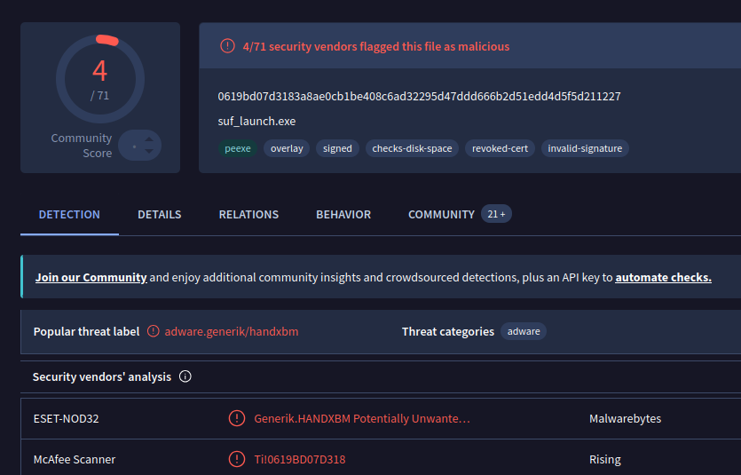
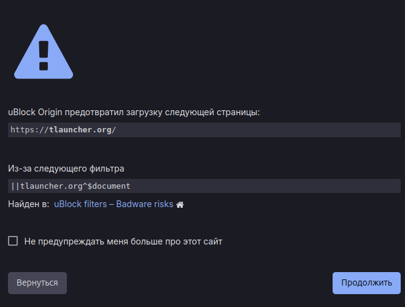

## Почему TLauncher лучше не использовать

### 🦠 Прямые угрозы безопасности

- **Закрытый код** - никто не знает что туда подмешивают разработчики
- Триггеры VirusTotal

- Триггеры Ublock

---

### 📦 Сомнительные репозитории

- TLauncher не использует **официальные репозитории Mojang**
- Версии Minecraft, моды и Java скачиваются с собственных или сторонних источников
- Никто не знает, что именно может быть добавлено в эти версии
- Так же это замедляет обновления, моды могут не запускаться из-за старых зависимостей.

---

### 🎮 Грязный бизнес

- **В список серверов принудительно добавляются «автодобы»**
- Эти сервера выкачивают деньги со школьников
- **Лаунчер имеет собственный ЧС**, может менять IP серверов и скрывать неугодные

---

### ✅ Безопасные альтернативы

_Ссылки кликабельны_

Лаунчер              | Лицензия                   | Для ОС
---                  | ---                        | ---
[X Minecraft Launcher](https://xmcl.app/ru/) | [!badge Не нужна|success] | Linux,Windows,Mac
[PineconeMC](https://pineconemc.com/) | [!badge Не нужна|success]  | Linux,Windows,Mac
[16Launcher](https://16-launcher.ru/) | [!badge Не нужна|success]  | Linux,Windows,Mac
[Prism Launcher](https://prismlauncher.org/) | [!badge Нужна|warning]  | Linux,Windows,Mac
[Modrinth App](https://modrinth.com/app) | [!badge Нужна|warning]  | Linux,Windows,Mac